<picture>
  <source media="(prefers-color-scheme: dark)" srcset="./assets/hero-dark.svg">
  <source media="(prefers-color-scheme: light)" srcset="./assets/hero-light.svg">
  
</picture>

 

---

I build systems that turn messy input into something a machine can execute — LLM pipelines, agents, and the infrastructure around them. Springer-published in deep learning; before that I wrote real-time control code for aero-engines at DRDO.

Most of what's below was built from scratch on purpose. A database engine without an ORM, a neural network without a framework, a CRDT editor without a backend that can read your data. It's the fastest way I know to actually understand a thing.

 

## Currently

**AI Intern · Infineon Technologies** — Bengaluru, India · Mar 2026 – Present

Building an LLM system that converts multimodal input (text, sketches, diagrams) into executable **BPMN 2.0** workflow models, deployed on a Red Hat OpenShift–based enterprise hybrid cloud.

 

## Featured work

| | |
|---|---|
| **[QueryForge](https://github.com/charanreddy-27/QueryForge)** · [live ↗](https://queryforge.charanreddy.dev) A SQL database engine written from scratch — B+tree storage, write-ahead logging, and a Volcano-model executor. `Python` `TypeScript` `B+tree` `WAL` | **[Synthesis](https://github.com/charanreddy-27/Synthesis)** · [live ↗](https://synthesis-charan.vercel.app) An autonomous multi-agent research engine that plans, searches, and synthesises a cited answer. `TypeScript` `LLM agents` `RAG` |
| **[Tracewave](https://github.com/charanreddy-27/tracewave)** Real-time streaming anomaly detection — SSE ingestion, one-second tumbling windows, and an ensemble of three online detectors with an explainable "why". `Python` `Redis Streams` `TimescaleDB` `Prometheus` | **[Synapse](https://github.com/charanreddy-27/synapse)** · [live ↗](https://synapse-charan.vercel.app) A local-first, end-to-end-encrypted collaborative canvas. The relay only ever sees ciphertext. `Next.js` `Yjs CRDT` `AES-256-GCM` |
| **[NeuroForge](https://github.com/charanreddy-27/neuroforge)** · [live ↗](https://neuroforge-charan.vercel.app) A neural network — forward pass, backprop, optimizers — hand-written in vanilla JS with zero dependencies. Gradient check agrees to ~2e-10. `JavaScript` `Backprop` `Canvas` | **[MeetEase](https://github.com/charanreddy-27/MeetEase)** · [live ↗](https://meet-ease-charan.vercel.app) AI-native video conferencing with scheduling, recordings, and real-time rooms. `Next.js` `TypeScript` `Stream SDK` |

More on the [portfolio ↗](https://www.charanreddy.dev) · everything else lives in [repositories ↗](https://github.com/charanreddy-27?tab=repositories)

 

## Research

**Lung disease detection from chest X-rays** — a hybrid ResNet50 architecture reaching **97.18%** accuracy. Published by Springer.

 

## Stack

**Languages** &nbsp;

**AI / ML** &nbsp;

**Backend & Data** &nbsp;

**Frontend** &nbsp;

**Platform** &nbsp;

 

## Background

- **B.Tech, Computer Science (Data Science)** · Christ University, Bengaluru · CGPA 8.9/10
- **1st place, ICE Tech 2025** — national hackathon
- **Department Head, CSE Student Body** — led initiatives for 400+ students · **Student Council Head**
- **Research Intern, DRDO** — algorithms and test automation for aero-engine control systems

 

---

**Open to conversations about LLM systems, agents, and developer tooling.**

[charanreddy.dev](https://www.charanreddy.dev) · [LinkedIn](https://www.linkedin.com/in/chandacharanreddy/) · [charanreddychanda@gmail.com](mailto:charanreddychanda@gmail.com)

